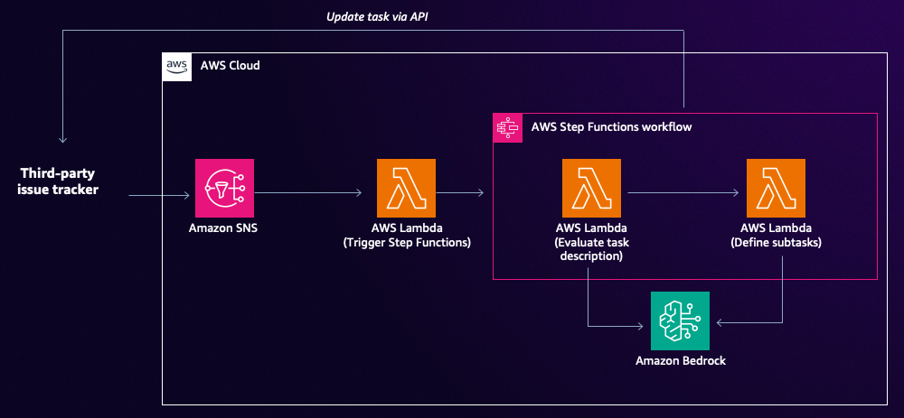

# Automating Kanban Workflows with AWS and Jira

This project implements an automated Kanban workflow system that integrates AWS services with Jira for enhanced task management and productivity.

The Automating Kanban Workflows project leverages AWS CDK to create a serverless architecture that automates key aspects of Kanban board management in Jira. It uses AWS Lambda functions, Step Functions, and Amazon SNS to review task descriptions, split tasks into subtasks, and manage the workflow between different stages of the Kanban process.



## Repository Structure

- `app.py`: The entry point for the CDK application.
- `automating_kanban_workflows/`: Main package containing the CDK stack and Lambda functions.
- `automating_kanban_workflows_stack.py`: Defines the AWS resources using CDK.
- `functions/`: Contains the Lambda function code for different workflow steps.
- `cdk.json`: Configuration file for the CDK application.

## Usage Instructions

### Prerequisites

- Python 3.12
- AWS CDK CLI
- AWS account and configured credentials
- Jira account with API access

### Amazon Bedrock Setup

1. Ensure you deploy this architecture in the following region
   - US East 1 (N. Virginia)

2. Enable the following foundation models in the Amazon Bedrock console:
   - Claude 3.5 Sonnet v2 (Anthropic)
   
   Note: You must explicitly enable each model in your AWS account before you can use them. To enable the models:
   - Navigate to the Amazon Bedrock console
   - Select "Model access" in the left navigation pane
   - Choose "Manage model access"
   - Select the required models and choose "Request model access"

### Installation

1. Clone the repository:
   ```
   git clone https://github.com/aws-samples/genai-for-devops.git
   cd automating-kanban-workflows
   ```

2. Install the required dependencies:
   ```
   pip install -r requirements.txt
   ```

3. Configure your AWS credentials:
   ```
   aws configure
   ```

4. Set up Jira credentials as environment variables:
   ```
   export JIRA_URL=<your-jira-url>
   export JIRA_USERNAME=<your-jira-username>
   export JIRA_API_TOKEN=<your-jira-api-token>
   ```

### Deployment

1. Synthesize the CloudFormation template:
   ```
   cdk synth
   ```

2. Deploy the stack:
   ```
   cdk deploy --context jira_api_token=$JIRA_API_TOKEN --context jira_url=$JIRA_URL --context jira_username=$JIRA_USERNAME
   ```

3. Note the output value for `JiraKanbanTopicArn`, which you'll need to configure Jira automation.

### Configuration

1. In Jira, [set up an automation rule to publish to the SNS topic](https://support.atlassian.com/cloud-automation/docs/configure-aws-sns-for-jira-automation/) when a task is created or edited.
2. Use the `JiraKanbanTopicArn` from the CDK output as the SNS topic ARN in your Jira automation settings.

## Data Flow

1. A new task is created or edited in Jira.
2. Jira automation publishes an event to the SNS topic.
3. The `trigger_kanban_automation_workflow` Lambda function is triggered by the SNS event.
4. The Lambda function starts the Step Functions state machine.
5. The state machine executes the following steps:
   a. `jira_task_description_review` Lambda function reviews the task description.
   b. If the description passes review, `jira_split_into_subtasks` Lambda function is called.
   c. If subtasks are created, they are added to the Jira board.
6. The workflow completes, and the task is ready for development.

## Infrastructure

The project uses AWS CDK to define the following resources:

- Lambda Functions:
  - `JiraTaskDescriptionReviewLambda`: Reviews Jira task descriptions.
  - `JiraSplitIntoSubtasksLambda`: Splits tasks into subtasks.
  - `TriggerKanbanAutomationWorkflowLambda`: Triggers the workflow when an SNS message is received.

- Step Functions:
  - `JiraKanbanWorkflow`: Orchestrates the task review and subtask creation process.

- SNS:
  - `JiraKanbanTopic`: Receives events from Jira to trigger the workflow.

- IAM:
  - Roles and policies for Lambda functions to access Bedrock and other AWS services.

## Troubleshooting

- If the workflow is not triggering:
  1. Check the SNS topic configuration in Jira.
  2. Verify the Lambda function logs in CloudWatch.
  3. Ensure the Step Functions state machine has the correct permissions.

- If task descriptions are not being reviewed:
  1. Check the Jira API token and URL in the Lambda environment variables.
  2. Verify the Bedrock model ARN is correct and accessible.

- For issues with subtask creation:
  1. Review the Jira permissions for the API user.
  2. Check the Lambda function logs for any Jira API errors.
