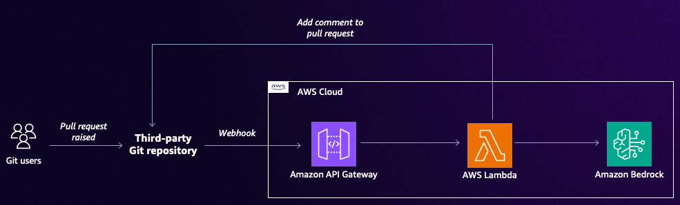

# GitHub Code Review Automation with AWS CDK and Bedrock

This project implements an automated code review system for GitHub pull requests using AWS CDK, Lambda, API Gateway, and Amazon Bedrock.

The system is designed to enhance code quality by automatically reviewing pull requests against a predefined set of best practices and providing feedback to developers. It leverages the power of AI through Amazon Bedrock to generate insightful code review comments.



## Repository Structure

- `app.py`: The main entry point for the CDK application.
- `cdk.json`: Configuration file for the CDK application.
- `improving_code_quality_reviews/functions/run_github_code_review/index.py`: Lambda function that performs the code review.
- `improving_code_quality_reviews/improving_code_quality_reviews_stack.py`: Defines the AWS infrastructure stack.

## Usage Instructions

### Prerequisites

- Python 3.12
- AWS CDK CLI
- AWS CLI configured with appropriate credentials
- [GitHub Personal Access Token](https://docs.github.com/en/authentication/keeping-your-account-and-data-secure/managing-your-personal-access-tokens) with repo scope
- GitHub Webhook with [Secret setup](https://docs.github.com/en/webhooks/using-webhooks/validating-webhook-deliveries#creating-a-secret-token)

### Amazon Bedrock Setup

1. Ensure you deploy this architecture in the following region
   - US East 1 (N. Virginia)

2. Enable the following foundation models in the Amazon Bedrock console:
   - Claude 3.5 Sonnet v2 (Anthropic)
   
   Note: You must explicitly enable each model in your AWS account before you can use them. To enable the models:
   - Navigate to the Amazon Bedrock console
   - Select "Model access" in the left navigation pane
   - Choose "Manage model access"
   - Select the required models and choose "Request model access"

### Installation

1. Clone the repository:
   ```
   git clone https://github.com/aws-samples/genai-for-devops.git
   cd improving-code-quality-reviews
   ```

2. Install the required dependencies:
   ```
   pip install -r requirements.txt
   ```

3. Configure your AWS credentials:
   ```
   aws configure
   ```

4. Set up your GitHub token and secret as an environment variable:
   ```
   export GITHUB_TOKEN=your_github_token_here
   export GITHUB_SECRET=your_github_secret_here
   ```

### Deployment

1. Bootstrap your AWS environment (if not already done):
   ```
   cdk bootstrap
   ```

2. Deploy the stack:
   ```
   cdk deploy --context github_token=$GITHUB_TOKEN --context github_secret=$GITHUB_SECRET
   ```

3. Note the API Gateway URL output after deployment.

### Configuration

The `cdk.json` file contains various configuration options for the CDK application. You can modify these settings as needed.

### Usage

To use the code review system:

1. Set up a GitHub webhook for your repository, pointing to the API Gateway URL with the `/review` endpoint.
2. Configure the webhook to trigger on pull request events.
3. When a new pull request is opened or updated, the system will automatically review the changes and post comments on the pull request.

## Data Flow

1. GitHub sends a webhook payload to the API Gateway when a pull request event occurs.
2. API Gateway triggers the Lambda function with the event payload.
3. The Lambda function:
   a. Extracts pull request details from the event.
   b. Fetches the diff content from GitHub API.
   c. Sends the diff to Amazon Bedrock for analysis.
   d. Receives the generated review comment from Bedrock.
   e. Posts the comment back to the GitHub pull request.

## Infrastructure

The project uses AWS CDK to define and deploy the following infrastructure:

### Lambda
- `GitHubReviewLambda`: Python 3.12 function that handles the code review process.
  - Environment variables:
    - `GITHUB_TOKEN`: GitHub Personal Access Token
    - `MODEL_ID`: ARN of the Bedrock model

### API Gateway
- `GitHubReviewAPI`: REST API with a single POST endpoint at `/review`

### IAM
- Lambda execution role with permissions to invoke Bedrock models

## Troubleshooting

### Common Issues

1. **Lambda function timing out**
   - Problem: The Lambda function exceeds the 5-minute timeout.
   - Solution: Increase the timeout in the `ImprovingCodeQualityReviewsStack` class:
     ```python
     timeout=Duration.minutes(10)
     ```

2. **Bedrock model invocation failing**
   - Problem: "AccessDeniedException" when invoking Bedrock model.
   - Diagnostic steps:
     1. Check the Lambda function logs in CloudWatch.
     2. Verify the IAM permissions for Bedrock in the Lambda execution role.
   - Solution: Ensure the correct Bedrock model ARN is specified and the Lambda has the necessary permissions.