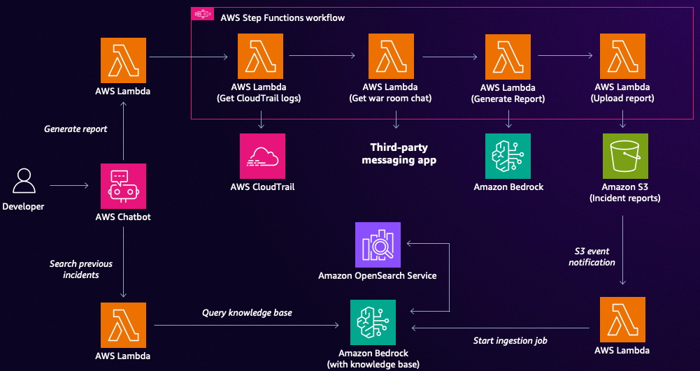

# Streamline Incident Response with AWS Services

This project implements an automated incident response system using AWS services to streamline the process of generating incident reports and searching previous incidents.

The Streamline Incident Response system is designed to automate the process of gathering relevant information when an incident occurs, generate comprehensive incident reports, and provide quick access to historical incident data for faster resolution.



## Repository Structure

The repository is structured as an AWS CDK application with Lambda functions organized in the `functions` directory. The main CDK stack is defined in `streamline_incident_response_stack.py`.

Key Files:
- `app.py`: The entry point for the CDK application.
- `cdk.json`: Configuration file for the CDK application.
- `streamline_incident_response_stack.py`: Defines the main infrastructure stack.

Integration points:
- CloudTrail: Used to retrieve relevant events during an incident.
- Slack: Integration for retrieving Slack messages related to an incident.
- Amazon Bedrock: Used for generating incident reports and searching previous incidents.
- AWS Step Functions: Orchestrates the incident response workflow.

## Usage Instructions

### Prerequisites

- Python 3.12
- AWS CDK CLI
- AWS account and configured credentials
- Jira account with API access

### Amazon Bedrock Setup

1. Ensure you deploy this architecture in the following region
   - US East 1 (N. Virginia)

2. Enable the following foundation models in the Amazon Bedrock console:
   - Claude 3.5 Sonnet v2 (Anthropic)
   - Claude 3 Haiku (Anthropic)
   
   Note: You must explicitly enable each model in your AWS account before you can use them. To enable the models:
   - Navigate to the Amazon Bedrock console
   - Select "Model access" in the left navigation pane
   - Choose "Manage model access"
   - Select the required models and choose "Request model access"

### Configuration

Before deploying, you need to set up the following environment variables:

- `SLACK_API_TOKEN`: Your Slack API token for retrieving messages.
- `SLACK_CHANNEL`: The Slack channel ID to monitor for incident-related messages.

You can set these in the CDK context or as environment variables.

### Installation

Prerequisites:
- Python 3.12 or later
- AWS CDK CLI v2.x
- AWS CLI configured with appropriate credentials

To install the project:

1. Clone the repository:
   ```
   git clone https://github.com/aws-samples/genai-for-devops.git
   cd streamline-incident-response
   ```

2. Install the required dependencies:
   ```
   pip install -r requirements.txt
   ```

3. Configure your AWS credentials:
   ```
   aws configure
   ```

4. Deploy the CDK stack:
   ```
   cdk deploy --context slack_api_token=$SLACK_API_TOKEN --context slack_channel=$SLACK_CHANNEL_ID
   ```

### AWS Chatbot Setup

To integrate [AWS Chatbot](https://aws.amazon.com/chatbot/) with this project, follow these steps:

1. Set up AWS Chatbot:
   - Go to the AWS Management Console and navigate to AWS Chatbot.
   - Click on "Configure new client" and select Slack as the chat client.
   - Follow the prompts to authorize AWS Chatbot in your Slack workspace.

2. Create a Slack channel for incident alerts:
   - In Slack, create a new channel (e.g., #incident-alerts) or use an existing one.

3. Configure AWS Chatbot for your Slack channel:
   - In AWS Chatbot, create a new configuration for the Slack channel you created.
   - Select the IAM role that has permissions to invoke Lambda functions.

4. Set up custom actions for CloudWatch alarms:
   - In AWS Chatbot, go to the "Configured clients" section and select your Slack configuration.
   - Under "Notifications", enable CloudWatch alarms.
   - In the "Custom actions" section, add two new custom actions:
     a. For generating reports:
        - Name: Generate Incident Report
        - Lambda function: Select the `chatbot_trigger_generate_report` function
     b. For searching previous incidents:
        - Name: Search Previous Incidents
        - Lambda function: Select the `chatbot_trigger_search_previous_incidents` function

5. Configure CloudWatch alarms:
   - Go to CloudWatch in the AWS Management Console.
   - For each alarm you want to integrate:
     - Edit the alarm and go to the "Actions" tab.
     - Add an action for the "In alarm" state and select "Send notification to AWS Chatbot".
     - Choose the Slack channel configuration you created earlier.

Now, when a CloudWatch alarm is triggered, it will send a notification to your Slack channel. You can use the custom actions to generate an incident report or search for previous incidents directly from Slack.

### Getting Started

Once deployed and AWS Chatbot is set up, the system will automatically respond to CloudWatch alarms:

1. When an alarm is triggered, a notification is sent to the configured Slack channel.
2. Use the "Generate Incident Report" custom action in Slack to start the incident response process.
3. The `TriggerGenerateReport` Lambda function is invoked, which starts the Step Functions workflow:
   - Retrieves relevant CloudTrail events and Slack messages.
   - Generates a markdown incident report using Amazon Bedrock.
   - Uploads the report to an S3 bucket.
4. The uploaded report triggers an ingestion job to add the incident data to the Bedrock Knowledge Base.
5. When the alarm resolves, use the "Search Previous Incidents" custom action in Slack to find similar past incidents.

### Common Use Cases

1. Generating an Incident Report:
   This happens automatically when you use the "Generate Incident Report" custom action in Slack after a CloudWatch alarm is triggered.

2. Searching Previous Incidents:
   Use the "Search Previous Incidents" custom action in Slack when an alarm resolves. This invokes the `ChatbotTriggerSearchPreviousIncidents` Lambda function.

### Troubleshooting

Common issues and solutions:

1. Problem: Lambda function fails due to missing permissions
   - Error message: "AccessDeniedException: User is not authorized to perform: [action] on resource: [resource ARN]"
   - Diagnostic process:
     a. Check the CloudWatch logs for the specific Lambda function
     b. Identify the exact permission missing from the error message
   - Solution: Add the required permission to the Lambda function's IAM role in the CDK stack

2. Problem: Step Functions execution fails
   - Error message: "States.TaskFailed: Execution failed due to an error in Lambda function"
   - Diagnostic process:
     a. Open the Step Functions console and locate the failed execution
     b. Identify which state failed and check its input/output
     c. Review the CloudWatch logs for the corresponding Lambda function
   - Solution: Debug the specific Lambda function that failed within the Step Functions workflow

## Data Flow

The Streamline Incident Response system processes incident data through several stages:

1. Incident Detection: CloudWatch alarm triggers a notification in Slack.
2. Report Generation: User initiates the process using the "Generate Incident Report" custom action in Slack.
3. Data Gathering: Parallel execution of `LookupCloudTrailEvents` and `LookupSlackEvents` Lambda functions.
4. Report Generation: `CreateMarkdownReport` Lambda function uses gathered data and Amazon Bedrock to create an incident report.
5. Storage: `UploadMarkdownReport` Lambda function stores the report in an S3 bucket.
6. Indexing: `StartIngestionJob` Lambda function is triggered by the S3 upload, ingesting the report into the Bedrock Knowledge Base.
7. Retrieval: User initiates the "Search Previous Incidents" custom action in Slack, which invokes the `ChatbotTriggerSearchPreviousIncidents` Lambda function to search past incidents using the Knowledge Base.

Note: The Step Functions workflow orchestrates the core incident response process, ensuring each step is executed in the correct order and handling any potential failures.

## Infrastructure

The Streamline Incident Response system is built using AWS CDK and consists of the following key resources:

Lambda Functions:
- `LookupCloudTrailEventsLambda`: Retrieves relevant CloudTrail events during an incident.
- `LookupSlackEventsLambda`: Fetches Slack messages related to an incident.
- `CreateMarkdownReportLambda`: Generates an incident report using Amazon Bedrock.
- `UploadMarkdownReportLambda`: Uploads the generated report to S3.
- `TriggerGenerateReportLambda`: Initiates the incident response workflow.
- `StartIngestionJobLambda`: Triggers the ingestion of new incident reports into the Knowledge Base.
- `ChatbotTriggerSearchPreviousIncidentsLambda`: Searches for previous similar incidents.

S3:
- `IncidentBucket`: Stores generated incident reports.

Step Functions:
- `GenerateReportWorkflow`: Orchestrates the incident response process.

Bedrock:
- `IncidentReportsKnowledgeBase`: Stores and indexes incident reports for quick retrieval.
- `IncidentReportDataSource`: Connects the S3 bucket to the Knowledge Base.

IAM:
- Various IAM roles and policies are created to grant necessary permissions to Lambda functions and other resources.

The infrastructure is defined in the `StreamlineIncidentResponseStack` class within the `streamline_incident_response_stack.py` file. This stack creates all the necessary AWS resources and sets up the relationships between them to enable the automated incident response workflow.